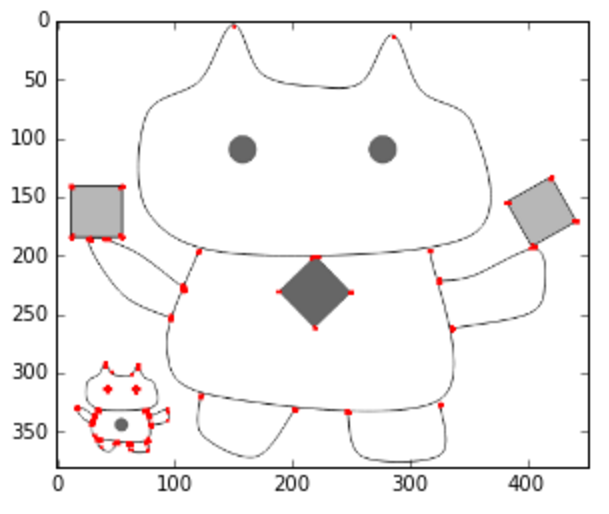
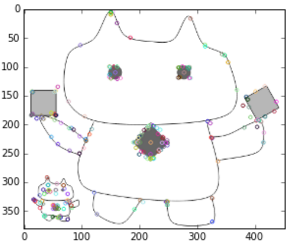
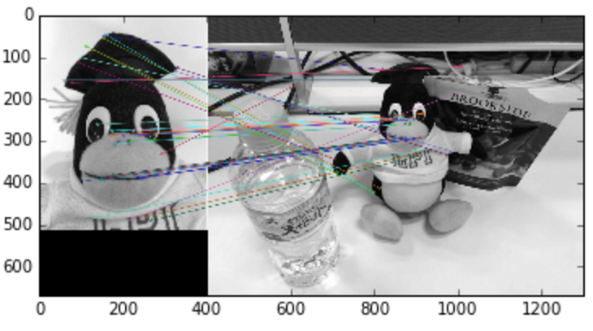

# cv_tutorial_feature

Tutorial to detect and describe the feature of image by [OpenCV](http://docs.opencv.org/master/index.html).

## [Go to the Tutorial (Jupyter notebook)](https://github.com/icoxfog417/cv_tutorial_feature/blob/master/cv_tutorial_feature.ipynb)

1. Harris Corner Detection  

2. SIFT  

3. Feature matching by SIFT  

