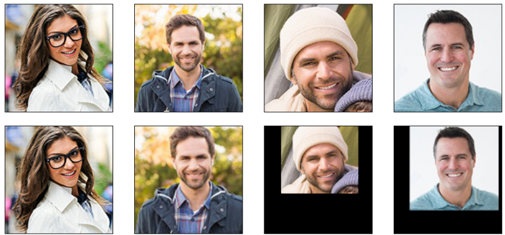

# cv_tutorial for machine learning

OpenCV for Machine Learning Tutorial

**[Go to the Tutorial (Jupyter notebook)](https://github.com/icoxfog417/cv_tutorial/blob/master/for_machinelearning/OpenCVforMachineLearning.ipynb)**

## Preprocessing

### Threshold

### Smoothing

## Segmentation and Detection

### Segmentation

### Detection

## Post processing

### Cut and Resize

### Alignment

