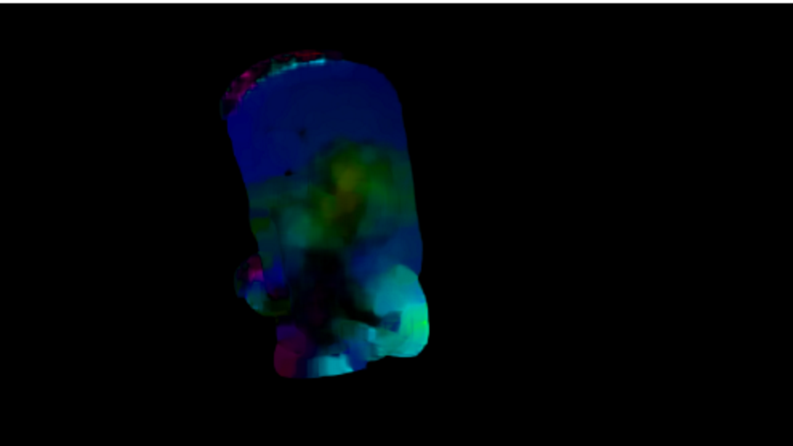

# cv_tutorial_opticalflow

Tutorial to detect sparse and dense optical flow by [OpenCV](http://docs.opencv.org/master/index.html).

video is provided by [NHK](http://www1.nhk.or.jp/creative/)!

## [Go to the Tutorial (Jupyter notebook)](https://github.com/icoxfog417/cv_tutorial/blob/master/opticalflow/cv_opticalflow_tutorial.ipynb)

1. Sparse Optical Flow([Lucas–Kanade method](https://en.wikipedia.org/wiki/Lucas%E2%80%93Kanade_method))  

2. Dense Optical Flow([Gunnar Farneback](http://www.diva-portal.org/smash/get/diva2:273847/FULLTEXT01.pdf))  

